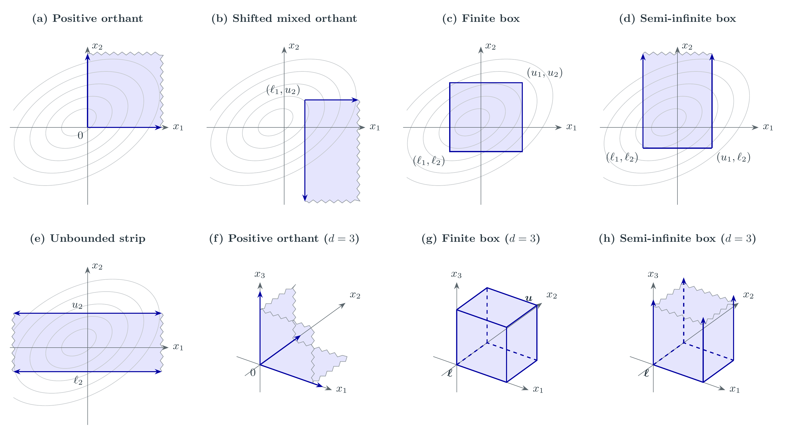
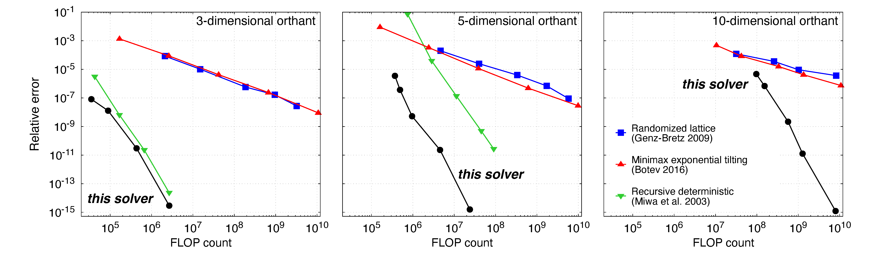

# Gaussian orthant probabilities

Compute multivariate Gaussian orthant and box probabilities to arbitrary
precision.

The evaluation method is based on a favourite trick of particle physicists:
introduce a 'time' variable to recast the integral as an ordinary differential equation
(here constructed symbolically using SymPy).
This is what is done in [BootLoops](https://github.com/BootLoops-ai/bootloops) on
which this code is based.

The method can achieve high numerical precision, but the number of boundary integrals
grows rapidly with dimension. It is most practical for low to moderate dimensions,
roughly d=3–15, depending on covariance structure and requested accuracy.
For substantially higher dimensions, consider an alternative method.

See [documentation](output/pdf/gaussian_orthant_methods.pdf) for a detailed description of the method.


## Performance
Below is a comparison of `orthant_solver` against three widely used methods
for computing Gaussian probabilities:
(i) randomized lattice integration (Genz-Bretz 2009),
(ii) minimax exponential tilting (Botev 2016), and
(iii) recursive deterministic integration (Miwa et al. 2003).
In this comparison the positive orthant is evaluated in dimensions 3,5 and 10.
A dense full-rank covariance matrix is used in each.


(Note: in the third plot the green curve is out of frame to the top right.)

The solver outperforms all other methods (much more so as the number of dimensions increases).
Other methods should be considered (e.g. Botev's method) if integrating
much higher than ten dimensions.

## Usage

To evaluate the domains labelled (a)-(e) in the banner image above:

```python
from gaussian_orthant import gaussian_probability

cov = [[1, 0.5], [0.5, 1]]
mean = [0, 0]

# (a) Positive orthant
a = gaussian_probability(
       lower=[0, 0], upper=["inf", "inf"],
       covariance=cov, mean=mean, digits=25)
print(a.probability)
print(a.log_probability)
print(a.diagnostics)

# (b) Shifted mixed orthant
b = gaussian_probability(
    lower=["0.6", "-inf"], upper=["inf", "0.8"],
    covariance=cov, mean=mean, digits=25)
print(b.probability)
print(b.log_probability)

# (c) Finite box
c = gaussian_probability(
    lower=["-0.9", "-0.7"], upper=["1.2", "1.3"],
    covariance=cov, mean=mean, digits=25)
print(c.probability)
print(c.log_probability)

# (d) Semi-infinite box
d = gaussian_probability(
    lower=[-1, "-0.6"], upper=[1, "inf"],
    covariance=cov, mean=mean, digits=25)
print(d.probability)
print(d.log_probability)

# (e) Unbounded strip
e = gaussian_probability(
    lower=["-inf", "-0.7"], upper=["inf", 1],
    covariance=cov, mean=mean, digits=25)
print(e.probability)
print(e.log_probability)
```
To evaulate higher-dimensional domains set the `mean`, `covariance`, `lower` and `upper`
arguments accordingly.
Note: instead of `covariance` one can pass the `precision` matrix (inverse covariance).

In addition to `gaussian_probability` (for boxes with arbitrary lower and upper bounds)
one can also call:

- `orthant_probability`: positive or negative orthants, with optional thresholds.
- `exchangeable_precision_probability`: equal finite bounds with an exchangeable precision matrix.
- `equicorrelated_probability`: equal bounds and nonnegative equal correlations.

For faster evaluation, specify `rtol` instead of `digits`, for example
`equicorrelated_probability(10, correlation=0.5, rtol=1e-6)`. The result
includes `rtol` and `estimated_relative_error`.
(Note: use decimal strings or `fractions.Fraction`, as in the code above, when inputs
need more precision than ordinary floating-point numbers. The result displays a
compact summary; access `result.probability` or `result.log_probability` for a value,
and use `result.as_dict()` for the full diagnostic record.)

Examples can also be run from the command line:

```sh
python3 -m gaussian_orthant examples/orthant.json
```

## Installation

Requires Python 3.9 or later and a local BootLoops checkout. From the project directory:

```sh
git clone https://github.com/BootLoops-ai/bootloops.git
python3 -m pip install -e '.[test]'
```

The `test` extra installs NumPy, SciPy, and pytest for the examples and validation tools.

For optional compiled arithmetic, install `python3 -m pip install -e '.[test,fast]'`.
This requires a Python version supported by `python-flint>=0.8`.

## Arithmetic and performance

Choose `backend="mpmath"` for Python arbitrary-precision arithmetic or
`backend="flint"` for compiled numerical and exact polynomial arithmetic
through python-flint. The default,
`backend="auto"`, selects a compatible compiled backend when available and
otherwise uses mpmath. An explicit compiled request requires a compatible
python-flint installation.

The compiled backend builds the general solver's boundary equations directly
from rational polynomial coefficients, sharing factors within each construction.
Runtime depends on dimension, matrix structure, requested precision, and
backend. Specialized routines can handle much larger problems than the
general solver. Precision checks may produce substantially more accuracy
than requested, so compare measured errors as well as runtimes when assessing
performance against SciPy or other methods.

## Limits

- General problems have a default limit of 256 boundary masters: up to eight one-sided or five fully bounded coordinates before symmetry reductions. Structured and independent cases can exceed these dimensions.
- Covariance and precision matrices must be positive definite.
- Convergence checks provide numerical evidence of accuracy, rather than rigorous bounds on the complete calculation. A convergence failure raises an exception.
- Use separate processes for concurrent evaluations; shared arithmetic contexts do not support concurrent threads.
